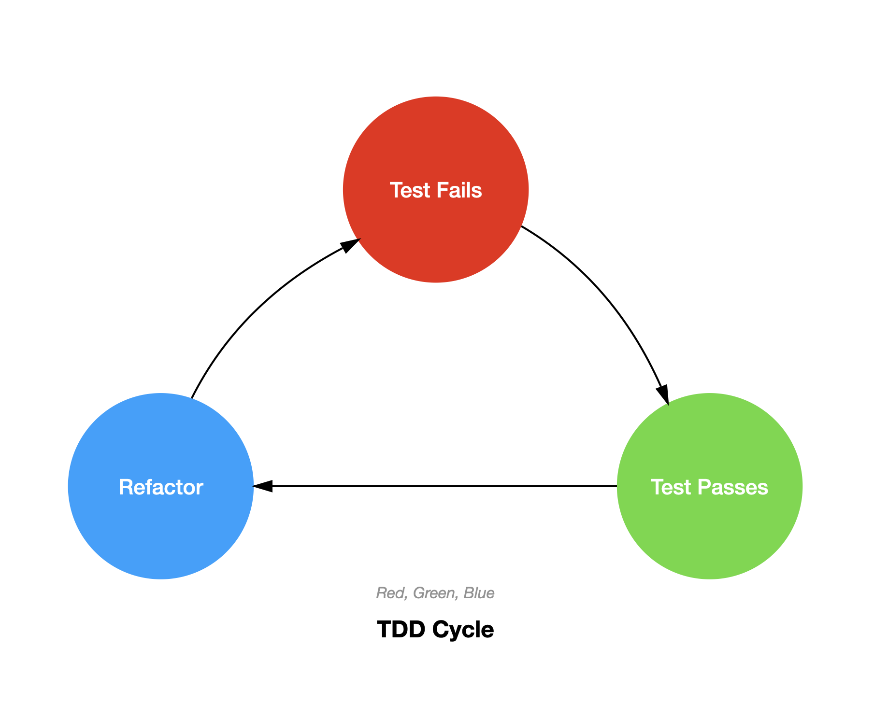

# Text

## Test Driven Development

Test-driven development reverses traditional development and testing. Usually, we write code first, then write tests to verify if the feature is working properly or not. But with TDD, you will write a test first, then add code until the test passes.

### TDD work flow

TDD is a cyclic process from Red - Green - Blue.

- Red stage

When a new feature is requested, the developer writes a test first. Upon running the test, the suite will fail. The red phase indicates that the code does not work.

- Green stage

In this stage, the developer writes the minimum code required to pass the test added. The test shows that the functionality of the code is already satisfied. The green phase indicates that everything is working, but not necessary in the most optimal way.

- Blue stage

In this stage, the developer can modify the existing code without changing the behaviour. This is also known as `Refactoring`. But with the help of tests, one can confidently change the code.

Then the cycle continues.

TDD banks on a _short development cycle_ where we get feedback early on and can prevent mistakes that might prove costly later.
